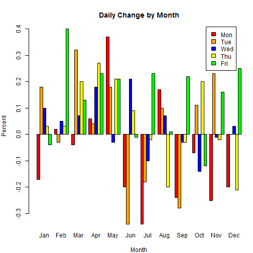

OXY Application
========================================================
author: LuAnn Born
date: January 15, 2015
autosize: true

What the Application Can Do:
========================================================
Specific for Occidental Petroleum Corporation, it will predict the best day of the week to buy or sell OXY stock based on the month that is input by the user. It can be modified to do the same computations for any other stock or mutual fund. The historical data files can be found at http://finance.yahoo.com/q/hp?a=&b=&c=&d=0&e=14&f=2015&g=d&s=OXY&ql=1 for OXY.
- Scroll down to the bottom of the page and click "Download to Spreadsheet" which creates a .csv file that can be read into the application.
- To download a different stock or mutual fund enter the ticker into the box next to "Get Historical Prices for:"
- Click "GO"

January:
========================================================


```
         Day   Month Percent
21    Friday January   -0.04
22    Monday January   -0.17
23  Thursday January    0.03
24   Tuesday January    0.18
25 Wednesday January    0.10
```
For example, in January over the last 30+ years the average change for each day from the previous trading day is reflected in the Percent column. Based on the historical data the web application will tell what day of the week to buy or sell the stock given a particular month.

Percent Change in Stock Price
========================================================

 
Conclusion 
========================================================
As can be seen from the barplot of weekdays by month, there is a pattern month-by-month that shows it could be more beneficial to buy or sell on particular days of the week in particular months. For example, it appears from the data that it is better to buy on a Monday or Tuesday in June, July or September. In addition, the best days to sell would be Fridays in February, July or December. Each month shows the best days to buy or sell.

While the differences from day-to-day might seem trivial the differences can add up to 1% for this particular stock on average. Fluctuations could be much more and might also be more pronounced on other stocks or funds.

